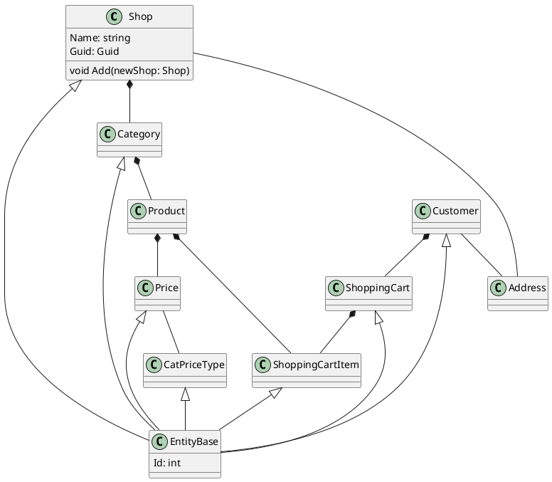

# Kauf-My-Stuff  <h1>

adsasddsa

## xy <h2>

asdasd

### 

...

###### <h6>

Lorem **ipsum** ***dolor*** sit amet, consetetur sadipscing elitr, sed diam nonumy eirmod tempor invidunt ut labore et dolore magna aliquyam erat, sed diam voluptua. At vero eos et accusam et justo duo dolores et ea rebum. Stet clita kasd gubergren, no sea takimata sanctus est Lorem ipsum dolor sit amet. Lorem ipsum dolor sit amet, consetetur sadipscing elitr, sed diam nonumy eirmod tempor invidunt ut labore et dolore magna aliquyam erat, sed diam voluptua. At vero eos et accusam et justo duo dolores et ea rebum. Stet clita kasd gubergren, no sea takimata sanctus est Lorem ipsum dolor sit amet.

Features:

1. asd
2. qwe
3. xcv

* asd
* qwe
* yxc

| a | b | c |
|---|---|---|
| 1 || 2    |

### Ein ID-Property

```C#
public int Id { get; set; }
```
xxx

